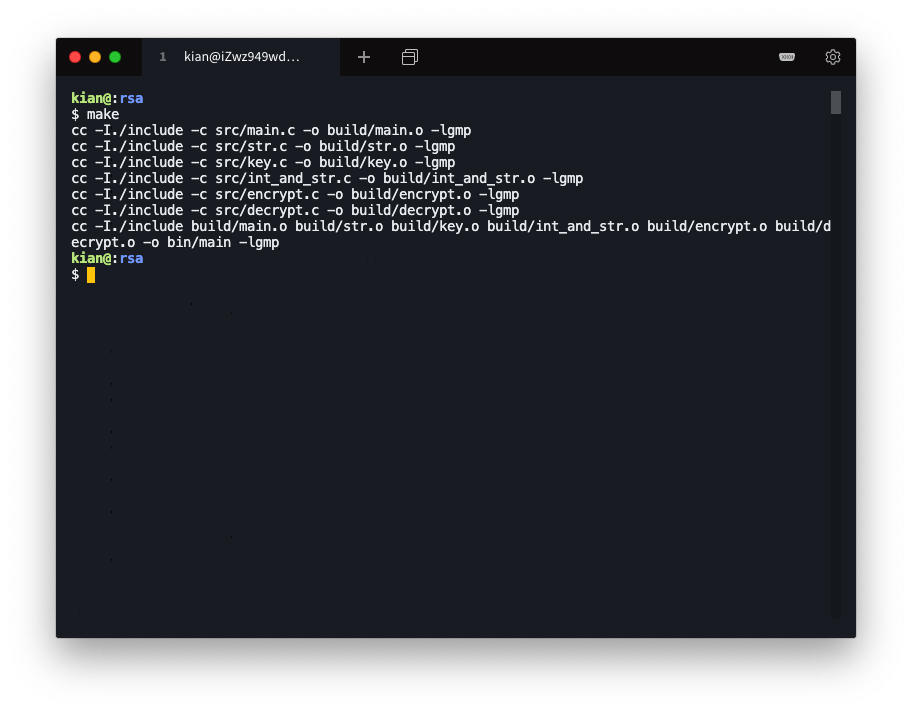

# Simple RSA Algorithm

## Background

This project implements the RSA algorithm with C.

This project is part of the assignment for the Information Security course.

## Install

This project uses `gcc`, `gmp`. Please configure the C Language environment. Go check it out if you don't have it locally installed.

Installation process

* Clone this repository.

* Execute the `make` command under the repository.

* Run the `main` executable file in the `bin` folder.

Reference

* How to Install `gmp`

    ```shell
    sudo apt-get install libgmp3-dev
    ```


## Usage

Usage run environment description

* Operating System: `Ubuntu 18.04.4 LTS (GNU/Linux 4.15.0-96-generic x86_64)`
* Compile Key：`gcc version 7.5.0 (Ubuntu 7.5.0-3ubuntu1~18.04)` 
* Auxiliary Compilation Library：`libgmp3-dev version (2:6.1.2+dfsg-2)`

The file structure is as follows


Enter the command `make` to start compiling.



#### Usage 1

Encrypt and decrypt the sample message string.


#### Usage 2

Encrypt and decrypt the input message string.

